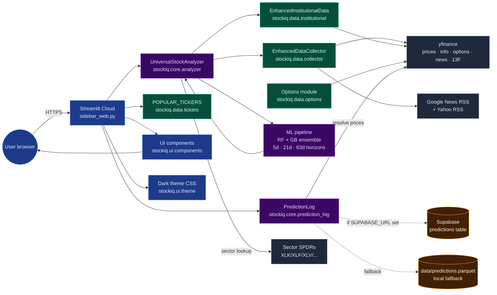

# StockIQ — Architecture

This doc is for contributors. User-facing features are in [README.md](README.md).

---

## High-level flow



Legend: green = data layer, purple = core logic, blue = UI, orange = storage, slate = external.

---

## Package layout

```
stock_analyzer/
├── sidebar_web.py              # Streamlit entry point (the whole page render)
├── stockiq/
│   ├── core/
│   │   ├── analyzer.py         # UniversalStockAnalyzer — orchestrates the full analyze() pipeline
│   │   └── prediction_log.py   # PredictionLog + calibrate_probs() / calibrate_confidence()
│   ├── data/
│   │   ├── collector.py        # EnhancedDataCollector — news, social, analyst, options data aggregation
│   │   ├── institutional.py    # EnhancedInstitutionalData — 13F holders, insider transactions, earnings
│   │   ├── options.py          # get_options_flow() + get_unusual_activity()
│   │   └── tickers.py          # POPULAR_TICKERS dict for the autocomplete dropdown
│   ├── models/
│   │   ├── predictor.py        # EnhancedPricePredictor (older, kept for back-compat shims)
│   │   └── sentiment.py        # AdvancedSentimentAnalyzer (VADER/FinBERT placeholder)
│   └── ui/
│       ├── components.py       # All render functions: header_band, kv_block, news_feed_block, ...
│       └── theme.py            # Dark CSS injected once per Streamlit session
├── migrations/
│   └── 001_predictions.sql     # Supabase schema
├── tests/
│   ├── test_imports.py         # Package smoke test
│   ├── test_deprecations.py    # Lint: no deprecated Streamlit/pandas APIs
│   ├── test_prediction_log.py  # PredictionLog round-trip + summary
│   ├── test_calibration.py     # calibrate_probs / calibrate_confidence math
│   ├── test_options_heuristics.py  # Aggressor + cluster detection
│   ├── test_sentiment.py       # Keyword-based _analyze_text_sentiment
│   ├── test_formatters.py      # fmt_price / fmt_pct / fmt_big_money
│   └── test_earnings_calendar.py   # dict vs DataFrame parsing
└── archive/                    # Older experimental files (streamlit_app.py etc.), not imported
```

At the repo root there are also backward-compat shim modules (`enhanced_data_collector.py`, `enhanced_institutional_data.py`, etc.) that just do `from stockiq.data.X import *`. They exist so that older user scripts importing those top-level names keep working; new code should import from `stockiq.*`.

---

## Data flow per analysis

Triggered by selecting a ticker (auto-analyze) or clicking the Analyze button:

1. **`sidebar_web.py`** reads the ticker from the selectbox, calls `UniversalStockAnalyzer(ticker).analyze_stock()`.
2. **Analyzer** orchestrates fetches in this order:
   - `EnhancedDataCollector.collect_enhanced_data()` → news sentiment (7 sources), social, analyst, options sentiment, economic indicators, rankings.
   - `EnhancedInstitutionalData.get_comprehensive_institutional_data()` → top 13F holders, insider transactions, earnings history, analyst recommendations.
   - `stock.history(period="1y")` → 1-year daily OHLCV.
   - `stock.info` → fundamentals, metadata.
   - `get_earnings_calendar()` → next earnings date (dict-form calendar + earnings_dates fallback).
   - `_fetch_sector_etf_history(info)` → 1-year sector ETF prices for peer relative strength features.
3. **Derived analyses**: `compute_technical_indicators(hist)`, `analyze_fundamentals(info, hist)`, `_process_enhanced_sentiment(enhanced_data)`.
4. **ML ensemble** runs three times with different horizons:
   - `create_enhanced_ml_prediction(..., horizon_days=5)` — 1-week direction
   - `create_enhanced_ml_prediction(..., horizon_days=21)` — 1-month direction
   - `create_regime_prediction(..., horizon_days=63)` — 3-month 3-class regime
5. **Backtest** runs `enhanced_backtest_strategy()` for the SPY + buy-and-hold comparison (backend only; not rendered).
6. **sidebar_web.py** receives the combined result dict, calls each panel render function against it, logs the three predictions to Supabase, and lazily resolves any predictions older than their horizon.

---

## ML pipeline

### Feature engineering

`_create_enhanced_features()` builds a `pd.DataFrame` indexed by trading day, with ~35 columns. The full list lives in the README; notable ones:

- **Rolling** (Series): returns at multiple windows, RSI, MACD, BB, SMA ratios, volume ratio, peer/sector relative strength at 1m and 3m.
- **Static** (broadcast across rows): news sentiment aggregates, 13F net flow, analyst ratings, economic data, days-to-earnings. These look identical for every row; they represent the "now" snapshot that informs the most recent prediction. Not ideal for training but the alternative (fetching historical news sentiment per day) is out of scope for free-tier.

### Training

- **Train/test split**: chronological 80/20, **no shuffle**. A shuffled split leaks future info into the training set and is the single most common mistake in time-series ML. Reported accuracy is genuine walk-forward performance.
- **Ensemble**: `RandomForestClassifier(n_estimators=100)` (60% weight) + `GradientBoostingClassifier(n_estimators=100)` (40%). Probabilities blended linearly.
- **Binary horizons** (1w, 1m): label = `Close[t+H] > Close[t]`. 3-class neutral derived post-hoc as `1 - |bull - bear|` and renormalized.
- **Regime classifier** (3m): label = `{BEARISH, SIDEWAYS, BULLISH}` based on threshold `σ · √63 · 0.5`. `class_weight='balanced'` to prevent the SIDEWAYS majority from dominating.
- **Price targets**: scale with horizon via `σ · √H · (0.5 + p_direction)`, not hard-coded percentages. A 1-week bullish target sits ~1σ above spot; a 1-month target ~2σ.

### Calibration (the feedback loop)

After each analysis, `_pred_log.log(...)` writes three rows to Supabase — one per horizon. On the next render, `PredictionLog.summary(horizon_days=H)` is called for each of 5/21/63 to pull that horizon's historical hit rate. If ≥ 5 resolved predictions exist, `calibrate_probs()` shrinks the raw model output toward uniform by a factor scaled to demonstrated edge:

```
trust = min(1.0, 2 · |hit_rate − 0.5|)
p_cal = p_raw + (⅓ − p_raw) · (1 − trust)
```

At hit_rate = 0.5, trust = 0 → full shrinkage to uniform. At 1.0, trust = 1 → no shrinkage. Below 0.5 we still shrink (small bad samples are noise more often than true inverse signal).

---

## Storage layer

Two backends, chosen at runtime based on whether `SUPABASE_URL` + `SUPABASE_KEY` are in `st.secrets` or env:

### Supabase (preferred)

- **Single table** `predictions` — schema in `migrations/001_predictions.sql`.
- Indexes: `(ticker)`, `(timestamp desc)`, `(timestamp) WHERE hit IS NULL` (partial index for the resolution job).
- RLS disabled for single-user app. The publishable key is safe to commit; Supabase is designed for client-side use.
- REST API via raw `requests` (no `supabase-py` dependency, keeps cold start fast).

Key operations:
- `_log_supabase()` — one `POST /rest/v1/predictions` per prediction.
- `_resolve_supabase()` — pulls up to 500 unresolved rows, filters by `timestamp + resolution_horizon_days ≤ now()` **in Python** (PostgREST can't express that interval arithmetic in a query param), groups by ticker so each yfinance price call resolves multiple rows, PATCHes each row individually.
- `_read_all_supabase()` — `GET /rest/v1/predictions?select=*&order=timestamp.desc&limit=2000`, returns a DataFrame.

### Parquet fallback

- File at `data/predictions.parquet`. Full read + full rewrite on every log (crude but fine at our scale).
- On Streamlit Cloud this survives reruns within a container but resets on redeploy — the main reason to prefer Supabase.

Both backends share the same public API (`log` / `resolve_pending` / `summary`) and the same row schema. Dispatch happens in the public methods via `self._using_supabase()`.

---

## UI layer

Streamlit renders the page top-to-bottom on every run (no partial updates except within `st.selectbox` reruns). To get a dense, non-scrollable layout we:

1. **Inject custom CSS** once via `inject_theme()` — hides the default Streamlit header/toolbar, crushes top padding, defines every panel's styling.
2. **Build HTML fragments in Python** and emit via `st.markdown(unsafe_allow_html=True)`. Most panels are single-shot HTML; only the chart uses `st.plotly_chart`.
3. **4-column grid** (`0.18 / 0.42 / 0.20 / 0.20`) via `st.columns()`. Each column is a thematic chunk (fundamentals / chart+analyst / smart money / AI+news).
4. **Session state** tracks the last analyzed ticker so a selectbox change auto-triggers a rerun with no button press.

### Hot-reload safety

Streamlit on Python 3.13 occasionally drops subpackages from `sys.modules` between reruns, triggering `KeyError: 'stockiq.core'` on the next import. Two defenses:

1. **`stockiq/__init__.py`** eagerly imports every subpackage (wrapped in `try/except` so a transient failure doesn't poison the parent module).
2. **`sidebar_web.py`** wraps its top-level `from stockiq.* import ...` statements in `_import_stockiq_modules()` which retries up to 3 times: on `KeyError` or `ImportError` starting with `'stockiq'`, it purges every `stockiq*` entry from `sys.modules` and reimports.

UI functions are also written defensively against signature mismatches: e.g., `probability_scenarios_combined` accepts `**kwargs` so new callers passing extra named args won't crash a stale cached copy of the function.

---

## External services

| Service | Purpose | Cost | Rate limit | Failure mode |
|---|---|---|---|---|
| yfinance | Prices, info, options, news, holders, earnings | Free | Unofficial — has scraped Yahoo Finance since ~2017, occasionally rate-limits | Silent retry, then empty result |
| Google News RSS | Headlines + publisher names | Free | None officially, practically loose | Timeout → skip source |
| Yahoo Finance RSS | Supplemental headlines | Free | Same | Timeout → skip |
| Sector SPDR ETFs | Peer relative strength (XLK etc.) | Free (via yfinance) | Inherited | Feature defaults to 0 |
| Supabase | Persistent prediction log | Free tier (500MB DB) | 50K monthly active users | Parquet fallback |

No paid APIs are required. The app has deliberately avoided Polygon / Unusual Whales / Benzinga Pro / Seeking Alpha Pro so it stays free for personal use. Adding any of them would be ~50 LOC of REST glue.

---

## Adding a new feature — checklist

1. **Data fetch**: add a method to `EnhancedDataCollector` (for news/social) or `EnhancedInstitutionalData` (for holdings/earnings), or a standalone function in `stockiq/data/` for something else. Return a plain dict; fail closed with `{}` or `None`.
2. **Feature engineering**: add the extracted fields to `_create_enhanced_features()`. Use a default (0 / 0.5) when upstream data is missing so `.fillna(0)` doesn't silently corrupt a real zero.
3. **UI panel**: write a render function in `stockiq/ui/components.py` that takes the new dict and emits HTML via `panel_open` / `panel_close`. Add the CSS to `stockiq/ui/theme.py`.
4. **Wire into `sidebar_web.py`**: import the new render function, call it in the right column.
5. **Test**: add a unit test under `tests/` covering the pure-logic parts (feature extraction, any math).
6. **Backward-compat shim** (only if naming something that external CLI scripts might import): add a root-level module `my_new_thing.py` that does `from stockiq.x.my_new_thing import *`.

---

## Known tech debt

- **XGBoost mention in older README was aspirational**, not real. The ensemble is RF + GB only.
- **`models/predictor.py` and `models/sentiment.py`** are half-wired. `create_ml_prediction()` in `analyzer.py` calls them as a fallback but the primary path is the inline ML in `create_enhanced_ml_prediction()`.
- **FinBERT is documented as a future option** but not wired. The current sentiment is a hand-curated keyword list in `_analyze_text_sentiment()`.
- **Some static features** (news sentiment aggregates, 13F flow) are broadcast across all training rows. This is a known imperfection — they should really be historical time series, but aggregator APIs don't expose them cheaply.
- **No partial UI updates**: every Streamlit rerun re-fetches yfinance data (yfinance does its own HTTP caching so it's not as bad as it sounds, but a proper cache layer would help).

---

## See also

- [README.md](README.md) — user-facing feature docs
- [tests/README.md](tests/README.md) — test coverage + how to add tests
- [migrations/001_predictions.sql](migrations/001_predictions.sql) — Supabase schema
